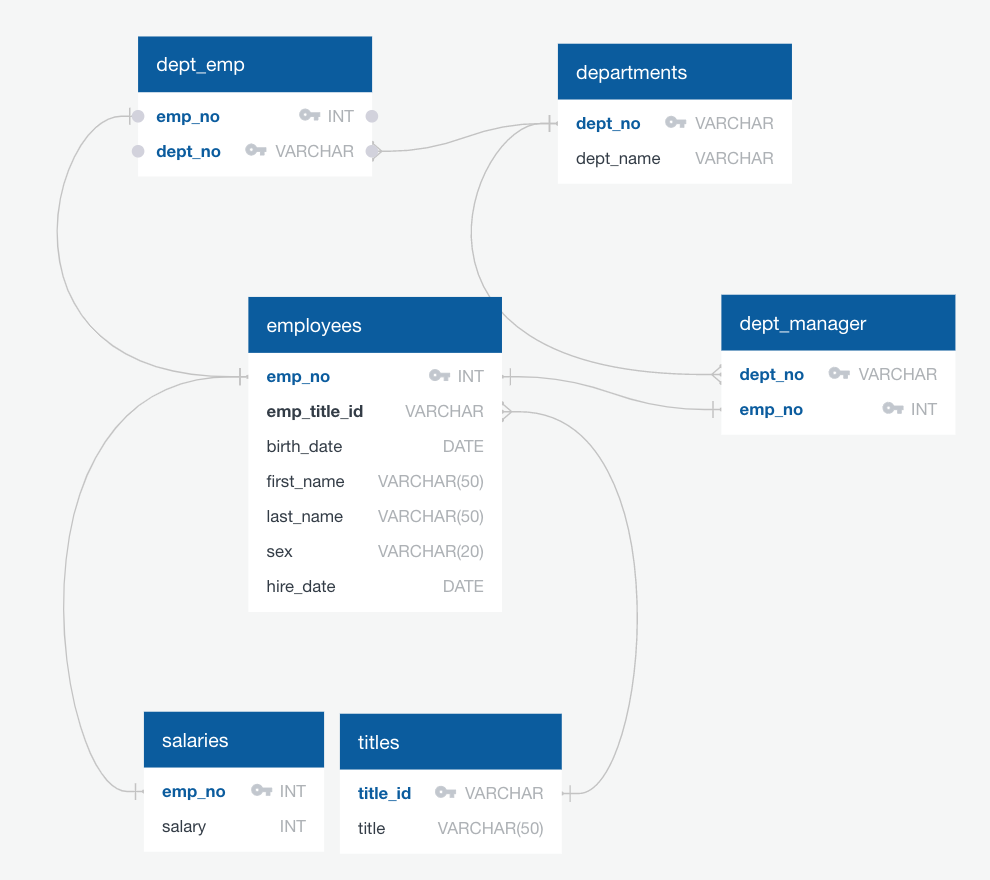

# SQL-Employee-Database

Penn Data Boot Camp Assignment 9 - Data Engineering, ERD, SQL queries, and data analysis with SQLAlchemy.

## Objective

1. Design tables/schemas in PostgreSQL based on a series of employee data (.csv)
2. Visualize the data model with an ERD (Entity Relationship Diagram)
3. Import the CSVs into a SQL databse
4. Performing SQL queries to answer questions about the data
5. Using SQLAlchemy, imoprt the SQL database into Pandas to perform further analyses

### ERD

### Questions to Answer with Queries
1. List the following details of each employee: employee number, last name, first name, sex, and salary.
2. List first name, last name, and hire date for employees who were hired in 1986.
3. List the manager of each department with the following information: department number, department name, the manager's employee number, last name, first name.
4. List the department of each employee with the following information: employee number, last name, first name, and department name.
5. List first name, last name, and sex for employees whose first name is "Hercules" and last names begin with "B."
6. List all employees in the Sales department, including their employee number, last name, first name, and department name.
7. List all employees in the Sales and Development departments, including their employee number, last name, first name, and department name.
8. In descending order, list the frequency count of employee last names, i.e., how many employees share each last name.
